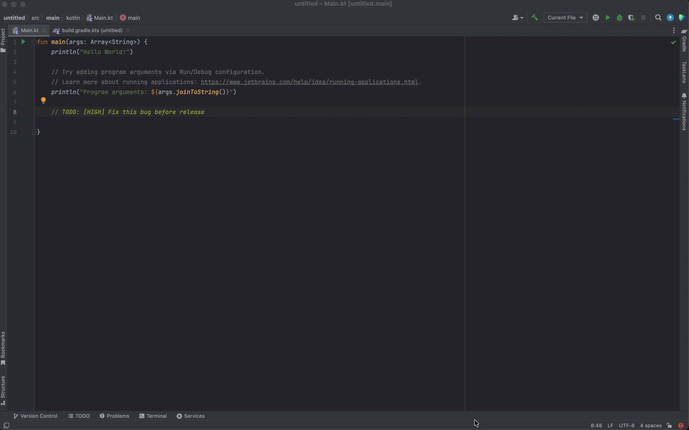

# TaskLens Pro

> A developer productivity plugin for IntelliJ-based IDEs that surfaces every TODO, FIXME, and HACK comment scattered across your codebase into a single, searchable, real-time dashboard.

<!-- Replace with your plugin banner or screenshot -->
<!--  -->

[](https://github.com/YOUR_USERNAME/tasklens/releases)
[](https://plugins.jetbrains.com)
[](LICENSE)

---

## ✨ What is TaskLens?

Developers leave `// TODO` and `// FIXME` comments everywhere — and then forget about them. TaskLens solves this by:

- **Auto-scanning** your entire project for TODO, FIXME, and HACK comments
- **Updating in real-time** as you type, edit, or delete comments
- **Filtering and searching** by type, priority, or keyword
- **Jumping to source** with a double-click

Never lose track of a task buried in code again.

---

## 🚀 Features

| Feature | Description |
|---------|-------------|
| 🔍 **Project-Wide Scan** | Automatically discovers TODO, FIXME, and HACK across all Kotlin, Java, and XML files |
| ⚡ **Live Updates** | Panel refreshes instantly as you add, edit, or remove comments — no manual refresh needed |
| 🏷️ **Priority Parsing** | Supports syntax like `TODO[HIGH]: Fix auth bug` or `FIXME[LOW]: Refactor later` |
| 🔎 **Smart Filtering** | Filter by comment type (TODO/FIXME/HACK), priority level, or free-text search |
| 🖱️ **One-Click Navigation** | Double-click any row to jump directly to the source file and line |
| 🔄 **Manual Refresh** | Keyboard shortcut `Ctrl+Shift+T` (or `Cmd+Shift+T`) to force a full rescan |

---

## 📦 Installation

### From JetBrains Marketplace (Recommended)

1. Open **IntelliJ IDEA** or **Android Studio**
2. Go to **Settings → Plugins → Marketplace**
3. Search for **"TaskLens Pro"**
4. Click **Install** and restart the IDE

### Manual Install

1. Download the latest `tasklens-1.0.0.zip` from [Releases](../../releases)
2. Go to **Settings → Plugins → ⚙️ → Install from Disk...**
3. Select the downloaded `.zip` file
4. Restart the IDE

---

## 🛠️ Usage

### 1. Open the TaskLens Panel

After installing, open the tool window:

**View → Tool Windows → TaskLens**

The panel will appear on the right side of your IDE.

### 2. Write TODOs in Your Code

TaskLens recognizes these patterns in Kotlin, Java, and XML comments:

```kotlin
// TODO[HIGH]: Implement user authentication before release
// FIXME[MEDIUM]: Memory leak in this callback
// TODO: Clean up unused imports
// HACK[LOW]: Temporary workaround for API v1
```

### 3. Watch the Dashboard Update

As you type, the TaskLens panel updates automatically. Use the filter bar to:

- **Search** by keyword or filename
- **Toggle** TODO / FIXME / HACK visibility
- **Filter** by priority (HIGH / MEDIUM / LOW)

### 4. Jump to Source

Double-click any row in the table to open the file and navigate directly to the comment line.

---

## 🏗️ Architecture

TaskLens is built on the **IntelliJ Platform SDK** and follows a clean separation of concerns:

```
┌─────────────────────────────────────────┐
│  UI Layer (Tool Window)                 │
│  ├── TodoToolWindowFactory              │
│  ├── TodoTableModel (JBTable)           │
│  └── TodoFilterPanel                    │
├─────────────────────────────────────────┤
│  Service Layer                          │
│  ├── TodoIndexService (background scan) │
│  ├── TodoRepository (in-memory cache)   │
│  └── NavigationService (jump to source) │
├─────────────────────────────────────────┤
│  Listener Layer                         │
│  ├── ProjectOpenListener (initial scan) │
│  └── TodoPsiTreeChangeListener (live)   │
├─────────────────────────────────────────┤
│  Model Layer                            │
│  ├── TodoItem, TodoType, Priority       │
└─────────────────────────────────────────┘
```

### Key Technical Decisions

- **PSI (Program Structure Interface)** — Parses code comments directly from the AST, not regex on raw text
- **Background Threading** — Full project scans run via `ProgressManager` to avoid freezing the UI
- **ConcurrentHashMap** — Thread-safe repository for real-time read/write between scanner and UI
- **PsiTreeChangeListener** — Incremental updates: only re-scans files that actually changed

---

## 🎥 Demo



---

## 🧪 Tech Stack

| Technology | Purpose |
|------------|---------|
| **Kotlin** | Primary language |
| **IntelliJ Platform SDK** | IDE extension framework |
| **Gradle + IntelliJ Plugin** | Build system |
| **Swing (JBTable, JBScrollPane)** | UI components |
| **PSI (Program Structure Interface)** | Code parsing and AST traversal |

---

## 📋 Requirements

- **IntelliJ IDEA** 2023.2+ or **Android Studio** Giraffe+
- **JDK 17+**

---

## 🔮 Roadmap

- [ ] Export TODO list to Markdown / CSV
- [ ] Git blame integration (show who wrote each TODO)
- [ ] Due date support: `TODO(2026-09-01):`
- [ ] Vulnerability / deprecation warnings for outdated TODOs
- [ ] Team sync: highlight TODOs added in the current sprint

---

## 🤝 Contributing

Contributions are welcome! If you find a bug or have a feature idea:

1. Fork the repository
2. Create a feature branch (`git checkout -b feature/amazing-feature`)
3. Commit your changes
4. Open a Pull Request

---

## 📄 License

This project is licensed under the **Apache License 2.0**.

See [LICENSE](LICENSE) for details.

---

## 🙋‍♂️ About the Author

Built by **Sangeeth** as a portfolio project to explore the IntelliJ Platform SDK and developer productivity tooling.

- GitHub: [@YOUR_USERNAME](https://github.com/YOUR_USERNAME)
- Plugin: [TaskLens on JetBrains Marketplace](https://plugins.jetbrains.com/plugin/YOUR_PLUGIN_ID)

> If TaskLens helped you stay organized, consider leaving a ⭐ on GitHub or a review on the Marketplace!
